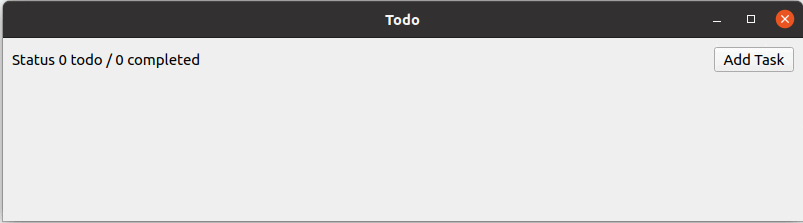

# TODO

A minimalist todo application built using Qt. Inspired by the book [Mastering Qt 5](https://www.packtpub.com/product/mastering-qt-5-second-edition/9781788995399).

### Highlights
* Create new tasks
* Check off list items
* Edit/remove task
* View status - number of tasks left and number of tasks finished.

<!-- recordmydesktop
v\https://askubuntu.com/questions/648244/how-do-i-create-an-animated-gif-from-still-images-preferably-with-the-command-l
https://github.com/nuttyartist/notes -->

